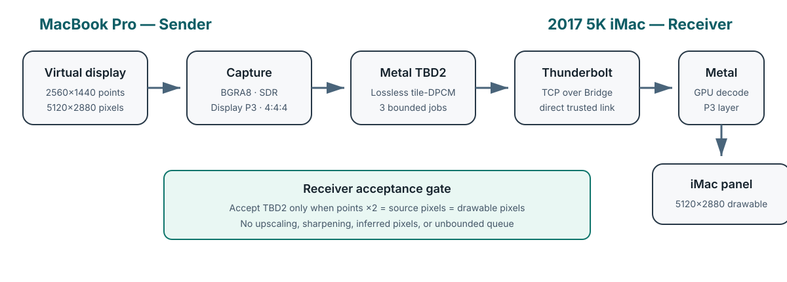
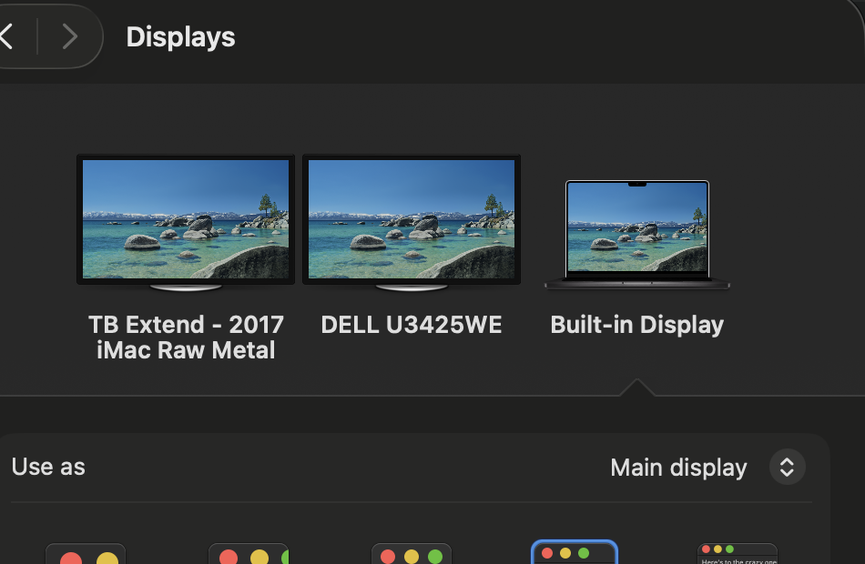

# iMac 5K Display Appliance

Turn one specific 2017 27-inch 5K iMac into a native-Retina extended display
for a MacBook, without opening the iMac or replacing its panel controller.

> **Personal project, not a product promise.** I built this for my own hardware.
> I am not committing to support other machines, maintain a public roadmap, or
> develop features on request. If it is useful, you are welcome to study, use,
> fork, and improve it under the repository's MIT license.

This is an independent, hardware-specific derivative of
[TargetBridge](https://github.com/swellweb/targetBridge). It is not an upstream
TargetBridge release, is not maintained or endorsed by TargetBridge's authors,
and is not affiliated with Apple. The complete lineage and third-party credits
are in [NOTICE.md](NOTICE.md).

## Current status

The experimental path is working on the owner's exact 2017 27-inch Retina 5K
iMac (`iMac18,3`, Radeon Pro 575). The sender creates an arranged virtual
display at **2560 × 1440 HiDPI points backed by 5120 × 2880 pixels at 60 Hz**.
A direct Thunderbolt Bridge TCP test measured **17.06 Gbit/s** on this setup.

The measured fidelity run used the lossless 8-bit TBD2/DPCM path: the sender
captures BGRA and the receiver reconstructs and presents the same full-resolution
RGB raster. This is distinct from the separate raw-NV12 diagnostic, which is
4:2:0. Do not combine the two into one generic raw full-RGB transport claim.

This is not production-complete and it does not yet prove a perfect, evenly
spaced 60 presentations every second. The first controlled serial/two-slot
comparison was:

| Receiver mode | Reported FPS (superseded oracle) | Reported gap p95 | p99 | Maximum | Still-valid integrity counters |
|---|---:|---:|---:|---:|---|
| Serial, one receive slot | 58.718 | 19.6 ms | 34.9 ms | 122 ms | 0 malformed, queue drops, renderer failures, GPU-command errors, or admission drops |
| Bounded overlap, two receive slots | **59.293** | **19.0 ms** | **34.0 ms** | **54.15 ms** | 0 malformed, queue drops, renderer failures, GPU-command errors, or admission drops |

Overlap is the **provisional candidate** because it improved the reported
cadence while adding only one fixed 64 MiB receive slot. Those presentation
counts are now superseded: the tested build counted Metal's zero presentation
timestamp as success, even though Apple defines it as not presented or dropped.
Version 0.5 corrects that oracle and sets `displaySyncEnabled` to `YES` by
default. Only the exact diagnostic override `TB_DISPLAY_SYNC=0` disables it;
version 0.6 additionally rechecks the final callback snapshot at the drain
deadline and fails closed on impossible presentation accounting. The corrected,
synchronized A/B must be repeated with the eventual qualified candidate. See the
[sanitized A/B record](docs/repro/imac-2017-5K/results/2026-08-30-serial-overlap-ab.md).

The recorded sustained resource runs are honest **qualified failures**, not
hidden release evidence. The first baseline measured +6.251 MiB/hour receiver
RSS. The installed v0.5/build 8 run improved that to +4.460 MiB/hour after a
1,200-second warm-up, with zero receiver heap leaks, storage growth, or thermal
warnings. Version 0.6/build 10 then reproduced a +7.363 MiB/hour post-warm-up
staircase and was stopped after 1,201 seconds. Version 0.7 removed a redundant
once-per-minute user-activity declaration and isolated a separate, bounded
ten-minute telemetry page ramp. Version 0.8/build 13 completed 3,600 seconds:
the sender, FDs, threads, disk, and thermal gates were stable, while receiver
RSS still rose +4.819 MiB/hour after 1,200 seconds. Because the securely locked
iMac completed zero presentations while both peers continued full-rate work,
v0.9 adds the explicit display-lifecycle pause/resume handshake now awaiting
paired physical acceptance.

| Area | Status |
|---|---|
| Native 2× Retina geometry | Observed: 2560 × 1440 HiDPI / 5120 × 2880 pixels at 60 Hz |
| Lossless TBD2/DPCM path | Component suites passed; corrected hardware cadence A/B pending |
| Native Metal 2017-iMac receiver | Implemented; lifecycle fixture passes |
| Native macOS display arrangement | Working alongside the Dell and built-in display |
| Launch and privacy identity | Stable installed paths plus per-user launch agents; sender Screen Recording remains bound to that stable TCC identity |
| Sleep and lock lifecycle | v0.9 adds an epoch-ordered receiver-surface/source-state barrier, black privacy cover, fresh-frame-before-unblank gate, and capture/GPU/audio pause; automated and live control-plane probes pass, while paired physical lock/wake acceptance remains open |
| Cursor | Foreground-only cursor contract implemented; human cursor acceptance not yet recorded, and an already-locked iMac still needs one physical unlock |
| RAM, storage, file-descriptor, and thermal soak | v0.8 completed 3,600 seconds with flat sender RSS, threads, FDs, and disk use and no thermal warnings, but failed the receiver RSS gate at +4.819 MiB/hour after 1,200 seconds; the locked iMac completed zero presentations, exposing the lifecycle bug now addressed in v0.9 |
| Public release | None; the GitHub repository remains private |

## What this is

The iMac does not become a passive DisplayPort monitor. It remains booted into
macOS and runs a small receiver. The MacBook creates a virtual Retina display,
captures its pixels, and sends them over IP on the direct Thunderbolt cable.
The receiver presents those pixels fullscreen on the built-in 5K panel.

That means the iMac can still run services such as SSH in the background, but
heavy work on it can compete with display latency. It also means this cannot
show the MacBook's FileVault, Recovery, or pre-login screen.

## What came from upstream, and what changed here

TargetBridge solved the product-shaped foundation: sender and receiver apps,
virtual extended and mirrored displays, Bonjour discovery, Thunderbolt Bridge
transport, encoded 5K streaming, input features, reconnect behavior, and a raw
NV12 diagnostic path.

This derivative focuses tightly on one fidelity and appliance goal. The table
is a provenance boundary, not a claim that the derivative invented inherited
work:

| Upstream foundation | Work in this derivative |
|---|---|
| Sender/receiver apps, virtual displays, H.264/HEVC streaming | Hardware-specific 2017-iMac appliance profile and integration |
| Earlier TBD2/DPCM work in PR #158 | Bounded integration, validation, telemetry, and exact-hardware A/B |
| Native-Metal receiver work in PR #174 | Radeon Pro 575 lifecycle, presentation telemetry, and terminal-failure hardening |
| General display profiles | Exact 2560 × 1440 HiDPI points → 5120 × 2880 pixels at 60 Hz gate |
| General network discovery | Pinned, fail-closed Thunderbolt Bridge selection |
| Interactive sender/receiver apps | Stable TCC identity, login launch agents, and appliance power lifecycle |
| General receiver window | Quiet appliance states and presentation-confirmed reconnect handoff |
| General cursor/input modes | Foreground cursor contract and duplicate-local-cursor suppression; physical acceptance still open |
| Default macOS idle behavior | Backed-up, reversible screen-saver idle policy plus optional, separately reversible screen-lock change; secure lock remains authoritative |
| Broad upstream documentation | Hardware-specific reproduction evidence and resource acceptance gates |

This work also integrates and hardens earlier lossless-codec work by Aykut
Alpgiray Ates and native-Metal receiver work by Betafer. It does not claim those
inventions. Exact pull requests and commits are recorded in
[NOTICE.md](NOTICE.md) and the [engineering account](docs/blog/imac-2017-5k-software-display.md).

## Reproduce the setup

Use the hardware-specific instructions rather than upstream release downloads:

1. Read the [2017 iMac overview](docs/iMac-2017-5K.md).
2. Follow the [build, install, verification, and rollback guide](docs/repro/imac-2017-5K/README.md).
3. Grant Screen Recording only after the sender is installed at its stable path.
4. Verify a true Thunderbolt Bridge path and the exact Retina point/pixel pair.
5. Re-run the same serial/overlap commands and the final-candidate resource soak.
6. Physically unlock an iMac session that was already locked before judging
   foreground cursor behavior; do not count automated cursor tests as human
   acceptance. A black iMac screen with only its local cursor in this state is
   the authoritative macOS secure-login layer covering an otherwise live
   receiver, not proof that the Thunderbolt stream stopped. The app does not
   bypass that security boundary; unlock the iMac once and it will reclaim the
   receiver surface.

The current app bundles retain some `TargetBridge` executable and bundle names
for source compatibility and stable macOS privacy identity while qualification
is underway. The repository, documentation, appliance profile, evidence, and
visible receiver waiting state are distinct. Bundle-identity migration must be
a deliberate versioned step because macOS may require Screen Recording again
when an app's path or code identity changes.

## Evidence, not marketing

The project records what was actually tested, including failures and remaining
gates. It does not reuse upstream screenshots or the inherited Italian UI
screenshots. The visual below was captured on the owner's test hardware and is
listed in the asset-provenance manifest; it is arrangement context, not cadence
or cursor proof.

- Plain-language build story: [docs/blog/imac-2017-5k-software-display.md](docs/blog/imac-2017-5k-software-display.md)
- Reproduction guide and result schema: [docs/repro/imac-2017-5K/README.md](docs/repro/imac-2017-5K/README.md)
- Visual ownership and sanitization: [docs/ASSET-PROVENANCE.md](docs/ASSET-PROVENANCE.md)
- Private-to-public release gate: [docs/PUBLICATION-CHECKLIST.md](docs/PUBLICATION-CHECKLIST.md)

Raw logs, system profiles, crash reports, and unredacted screenshots are not
published because they can contain names, paths, hostnames, addresses, device
identifiers, or screen contents.

## Security and operational limits

The experimental TCP display protocol is not authenticated or encrypted. Use
it only on the trusted direct Thunderbolt link; do not expose port 54321 to an
untrusted LAN. See [SECURITY.md](SECURITY.md).

No kernel extension, firmware patch, privileged daemon, or iMac disassembly is
used. Runtime queues are bounded, frames are not written to disk, logs are
bounded, and the final acceptance includes RAM, file-descriptor, storage,
thermal, and battery measurements.

## License and credit

The repository retains the upstream MIT license and Marco Caciotti's original
copyright notice unchanged in [LICENSE](LICENSE). The derivative modifications
are offered under the same MIT terms. When redistributing this repository or a
substantial portion of it, keep the required copyright and permission notices.
See [NOTICE.md](NOTICE.md) for authorship, code provenance, and the no-endorsement
statement. See [CONTRIBUTING.md](CONTRIBUTING.md) for the fork-first,
no-support-SLA contribution posture.

Apple, MacBook Pro, iMac, Retina, and Thunderbolt are trademarks of their
respective owners.
