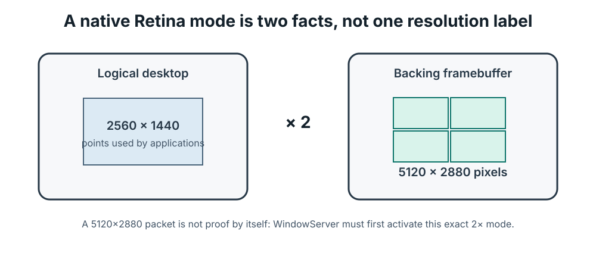
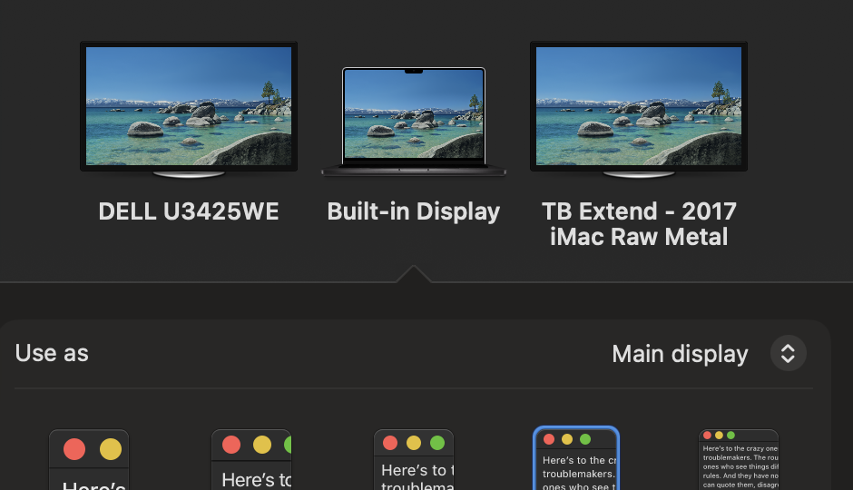

# Turning a 2017 5K iMac into a software display appliance

> **Status:** active hardware experiment. The isolated codec, protocol, and
> Metal gates described below pass. The corrected Retina probe and the final
> sustained end-to-end 2017-iMac run still need a recorded rerun from an
> immutable revision, so this document does not claim a production release or
> zero latency.

Apple's [technical specifications](https://support.apple.com/111969) list a
5120 × 2880 P3 Retina panel and Thunderbolt 3 video **output** for the 27-inch
2017 iMac. It is not among the iMacs that support Apple's
[Target Display Mode](https://support.apple.com/105126), which stops at mid-2014.
Its Thunderbolt ports are therefore computer ports, not passive monitor inputs.
The practical question was not “which display driver do we install?” It was:

1. How do we make macOS render a real Retina extended desktop?
2. How do we move those pixels across the cable quickly enough?
3. How do we put them on the iMac panel without softening text?
4. How do we make the result recover automatically and remain safe when it is
   left running all day?

The answer is a two-computer display appliance. The MacBook creates and captures
a virtual display. The iMac remains booted into macOS, receives the frame stream,
and presents it fullscreen. No iMac is opened and no panel cable is changed.

## What TargetBridge had already solved

This work starts with [TargetBridge](https://github.com/swellweb/targetBridge),
not from a blank repository. Upstream already supplied the product-shaped half
of the answer:

- Sender and Receiver applications;
- mirrored and extended virtual displays;
- Bonjour discovery;
- Thunderbolt Bridge networking;
- H.264/HEVC streaming up to 5K, including an experimental 5K60 profile;
- input, audio, brightness, clipboard, and reconnect-related features;
- a raw NV12 diagnostic path.

That is already enough to make an iMac useful as a software display. The gap for
this experiment was narrower: the normal 5K path is a video path. HEVC is a good
portable default, but encoding, decoding, chroma subsampling, and buffering can
make desktop text look unlike a direct Retina display. Upstream itself labels
5K60 experimental and recommends 5K48 for reliable daily use. In the current
Sender, the `Work 5K` display profile selects the 48 FPS `native5k` preset; it is
not the separate 60 FPS experimental preset used for this DPCM acceptance work.

Several pieces on our branch also come from newer TargetBridge maintenance work,
not from us. In particular, the direct native-Metal receiver path was developed
by Betafer in [PR #174](https://github.com/swellweb/targetBridge/pull/174). The
acknowledgements section records the exact provenance.

## The earlier lossless experiment we built upon

Aykut Alpgiray Ates's closed draft [PR #158](https://github.com/swellweb/targetBridge/pull/158)
asked almost exactly the fidelity question. It developed TBD1/TBD2, a tiled
differential-pulse-code-modulation format designed for a GPU encoder and GPU
decoder. The PR measured a locked lossless 5K60 result on an M4 Pro MacBook and
a **2020 iMac with Radeon Pro 5300**.

That result is important prior art, but it is not proof for this machine. The
2017 iMac uses a Radeon Pro 575, the PR was never merged, and its final result
used a broader stack that included slicing, 10-bit presentation, keep-warm
behavior, and asynchronous presentation.

We therefore did not copy its headline number. We extracted its tested codec
mathematics and GPU design, then integrated the smallest conservative path into
the maintained receiver architecture and tested the gates again.

## What this branch changes

The current milestone deliberately uses one complete 8-bit frame at a time:

- opaque BGRA, with full-resolution red, green, and blue channels (4:4:4);
- lossless TBD2 tile-DPCM compression;
- one packet type (`0x25`) negotiated only when the receiver actually compiles
  both its GPU decoder and packed-pixel presentation pipeline;
- three bounded sender jobs and three bounded receiver upload slots;
- no raw-BGRA fallback, no unbounded queue, and no frame files on disk;
- explicit SDR Display P3 capture and Display P3 Metal-layer labeling;
- a receiver guard that rejects TBD2 unless source and drawable dimensions
  match exactly; accepted frames use nearest-neighbour sampling without
  enlargement or sharpening.

This branch also adds hardening that was not present in that form in the draft:

- undefined signed-left-shift behavior removed from the C and Metal zig-zag
  residual encoders;
- framing length, integer overflow, geometry, stride, IOSurface-span, and
  malformed-payload validation before untrusted bytes reach the shader;
- explicit sample-buffer and pixel-buffer lifetime ownership until GPU
  completion;
- safe rejection cleanup and encoder draining;
- all-band Metal command construction before commit plus a two-second bounded
  teardown quarantine, so a rare resource failure cannot partially submit a
  frame, hang the sender forever, or free memory still reachable by the GPU;
- a true-Retina activation gate: capture does not begin until macOS reports
  2560 × 1440 logical points backed by 5120 × 2880 pixels;
- a dedicated 2017-iMac appliance Receiver with Bonjour advertisement,
  reconnect waiting, idle-system/display-session power assertions, and a
  fullscreen shielding window locked to the active built-in 5120 × 2880 panel;
- a quiet native waiting surface with distinct detected, starting, interrupted,
  and rejected states plus idle-only About/Quit controls; it has no animation,
  polling timer, or idle Metal workload;
- a presentation-epoch gate that keeps the waiting surface over a drawable
  Metal layer until macOS confirms a frame from the current connection was
  actually presented, preventing a stale desktop flash during reconnect;
- a bridge-only receiver gate that rejects sessions unless the accepted
  socket's local address is the current link-local address on `bridge0`;
- transport-specific Bonjour endpoint selection on the sender, so simultaneous
  Thunderbolt and USB-NCM link-local addresses cannot be cross-wired;
- a serial transport worker with one reusable packet buffer while AppKit owns
  the main run loop; partial packets and static desktops therefore cannot
  freeze the receiver window, and the handoff cannot grow into a frame queue;
- transient geometry, malformed-frame, and reconnect failures that close only
  the current session, while genuine Metal/GPU failures exit for throttled
  launchd restart instead of silently downgrading fidelity;
- a persistent decoded 5K Metal texture plus three geometrically grown upload
  buffers, with allocation counters proving the hot path does not create a new
  texture view or retire a slightly larger buffer on every frame;
- permission preflight that requests Screen Recording once and suspends
  automatic retries when permission is absent;
- Release builds, bounded debug logs, size-managed unified receiver diagnostics,
  and launchd restart throttling.

The accepted cursor path is deliberately the standard macOS cursor captured by
ScreenCaptureKit. The receiver hides the iMac's local cursor only for the live
session and balances that hide on disconnect before releasing its display-awake
assertion. TargetBridge's separate custom **Large Cursor** option remains off in
this appliance build; packet-only overlay redraw on a static DPCM texture is a
documented follow-up, not part of the result below.

This is integration and reliability hardening, not invention of TargetBridge,
native Metal, or TBD2.

## Why the analogies mattered

The useful leap was to stop treating the iMac like a missing HDMI input.

### A headless display, not a mirrored screenshot

Virtual-camera and headless-display systems separate logical layout from backing
pixels. That analogy made “5K” two different numbers: 2560 × 1440 **points** and
5120 × 2880 **pixels**. A 5120-pixel packet can still contain a scaled low-resolution
desktop, so packet dimensions alone are not proof of Retina rendering.

### A thin client, not a passive monitor

The iMac remains a computer. Thin-client and game-streaming systems suggested
the capture → transport → presentation decomposition, but desktop text changed
the optimization target: fidelity and deterministic latency matter more than
very low video bitrates.

### A framebuffer codec, not a movie codec

Remote-framebuffer systems exploit spatial repetition and changed regions.
TBD2 makes 8 × 8 tiles independent and uses a cheap left-neighbour predictor.
The jagged leap from “DPCM is serial” to “a row prefix sum is parallel” is what
makes GPU decoding plausible.

### A bounded real-time queue, not a file transfer

Audio engines and camera pipelines routinely drop stale work instead of allowing
latency to grow. The Sender caps the combined encode/send work at three frames.
The Receiver permits at most three GPU submissions and has three upload slots;
its separate current-packet buffer is also fixed at 64 MiB. A late frame is less
useful than the next current one.

## What the tests currently prove

The current commands and sanitized component-result summaries live under
[`docs/repro/imac-2017-5K`](../repro/imac-2017-5K/README.md).

| Gate | Current result | What it proves |
|---|---:|---|
| Sender unit suite | 133/133 | Protocol framing, automation parsing, profile and discovery behavior |
| Receiver network parser | 73 checks | Bounded packet framing and malformed lengths |
| TBD2 codec | 290 checks | Exact CPU round-trip and malformed-blob rejection at 8 and 10 bits |
| DPCM GPU lifecycle | 43 checks | Pre-commit failure cleanup and bounded teardown quarantine |
| Receiver input queue | 562 checks | Bounded input-event behavior |
| Receiver profile | 13 checks | Panel/logical/backing profile selection |
| Renderer policy | 22 checks | Deterministic native-Metal fallback policy |
| Raw NV12 parser | 99 checks | Strict raw diagnostic parsing |
| Receiver shutdown fixture | Passed | Idle listener, active peer, descriptor reuse, and closed post-shutdown admission |
| Receiver installer-order fixture | Passed | A disabled launchd override is cleared before bootstrap |
| Native Metal fixture | 192 frames passed | Real GPU pipelines, stable 3/1/1 DPCM reuse, and presentation-epoch handoff |
| Virtual display probe | **pending recorded rerun** | Must show 2560 × 1440 points → 5120 × 2880 pixels on the sender |
| iMac end-to-end DPCM | **pending** | Required before any production claim |
| Soak/reconnect/resources | **pending** | Required before any production claim |

The component results are encouraging, but the final proof must happen on the
actual Radeon Pro 575. Numbers measured on the 2020 iMac in PR #158 are cited as
prior work, not copied into our result column.

## Screenshots and physical evidence

The native macOS Displays pane now lists the Dell, the MacBook panel, and the
TargetBridge iMac together. This is important: the iMac stream is backed by a
real extended virtual display, so macOS—not a remote-control window—owns its
arrangement and logical coordinate space.

The final version of this post will include the following sanitized evidence:

1. The physical 2017 iMac Thunderbolt port and the exact cable.
2. Network settings showing Thunderbolt Bridge on both Macs.
3. System Information showing a 40 Gb/s physical Thunderbolt link, with serials
   and device identifiers removed.
4. The Retina probe showing 2560 × 1440 points and 5120 × 2880 pixels.
5. A synthetic text/color/grid target on the iMac panel.
6. The sustained DPCM result, reconnect result, and resource graphs.

Screenshots are added only after redaction. Raw `system_profiler`, `.xcresult`,
dSYM, and log files are not published because they contain user paths, device
identifiers, hostnames, IP addresses, or process metadata.

## Reproduce it

The short version is:

1. Use a 2017 27-inch 5K iMac (`iMac18,3`) and an Apple Silicon sender Mac.
2. Connect them with a certified Thunderbolt 3-or-newer cable and enable
   Thunderbolt Bridge on both Macs.
3. Build the sender and dedicated receiver from one immutable commit.
4. Install each app at its final stable path before granting privacy permission.
5. Grant Screen Recording to the sender once.
6. Start the receiver, then the separate experimental 5K60 preset with DPCM
   enabled. Do not report the 48 FPS `Work 5K` profile as 60 FPS.
7. Verify the direct interface, Retina point/pixel pair, DPCM negotiation,
   source/drawable 5120 × 2880 match, and Display P3 label.
8. Run the bounded test, soak, unplug/replug, and sleep/wake recipes before
   enabling login automation.

The detailed build, verification, rollback, and evidence commands are in the
reproduction guide. Do not expose port 54321 on an untrusted LAN: the current
experimental protocol is not authenticated or encrypted and carries screen
contents in plaintext. Prefer the isolated direct Thunderbolt link.

## What “done” means

For this project, done is experiential, not rhetorical:

- plug in the cable and get an extended display without manual terminal work;
- native 2× Retina geometry and lossless 4:4:4 text;
- usable cursor, clicking, dragging, Spaces, and normal MacBook input;
- coexistence with the Dell display and power connection;
- recovery after unplug/replug and sleep/wake;
- stable frame cadence without an accumulating queue;
- flat memory/file-descriptor/log-size trends during a sustained run;
- acceptable measured CPU, GPU, temperature, and battery impact.

Until all of those pass on the exact hardware, the honest label is “promising
experimental appliance,” not “production-grade monitor replacement.”

## Where AI could help—and where it should not

AI should not invent pixels, sharpen text, or sit in the critical display path.
That would add latency and violate the native-fidelity goal.

A phase-two experiment could classify frame entropy or change structure and
choose between already-correct transport strategies before congestion occurs.
It ships only if it beats a deterministic heuristic on predeclared metrics:
p99 latency, missed 16.7 ms deadlines, bandwidth, CPU/GPU energy, and false
switches. If it does not produce a measurable improvement, it remains a research
note rather than a dependency.

## Acknowledgements and provenance

- [TargetBridge](https://github.com/swellweb/targetBridge) and Marco Caciotti
  provided the MIT-licensed Sender/Receiver foundation.
- Aykut Alpgiray Ates developed the earlier TBD1/TBD2 and GPU experiment in
  [PR #158](https://github.com/swellweb/targetBridge/pull/158), especially the
  [TBD1 codec](https://github.com/swellweb/targetBridge/pull/158/commits/740c2babbd01ab3eb360c187c7cb26dc6b936076),
  [GPU decoder](https://github.com/swellweb/targetBridge/pull/158/commits/43abe4e45f80a66695d7c27d41c7cd05b2608ae3),
  [TBD2 format](https://github.com/swellweb/targetBridge/pull/158/commits/29f557602bf74d080c3fcdc5f6b4dff94ed70b9e),
  and [GPU encoder](https://github.com/swellweb/targetBridge/pull/158/commits/08bf28f6b2cf0b7f2e1f58e8b32f95e17d2850d2)
  commits.
- Betafer developed the native-Metal receiver in
  [PR #174](https://github.com/swellweb/targetBridge/pull/174), specifically its
  [zero-copy path](https://github.com/swellweb/targetBridge/pull/174/commits/32bcf3dc15b56e42e84b35eebe2fe3478dc38e2b)
  and [validation/Display P3 work](https://github.com/swellweb/targetBridge/pull/174/commits/1d2d62cdbda3b6eccf24adfa9336a8bb53b07b77).
- Additional TargetBridge contributors are credited in the upstream history.

The repository retains the upstream MIT license and copyright notice. This is
an independent experimental branch, not an official Apple or TargetBridge
release. Apple, MacBook Pro, iMac, Retina, and Thunderbolt are trademarks of
their respective owners.
