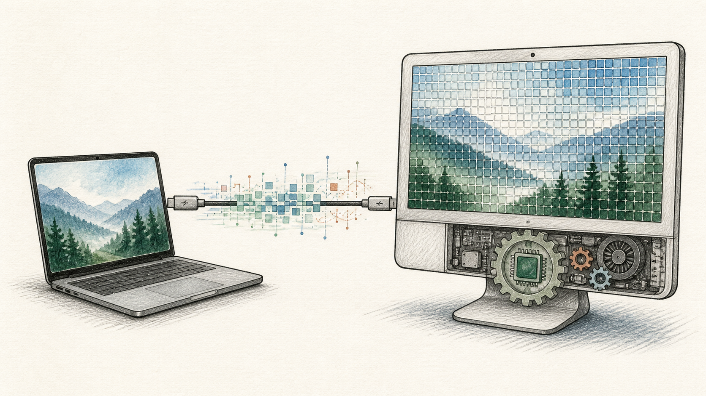
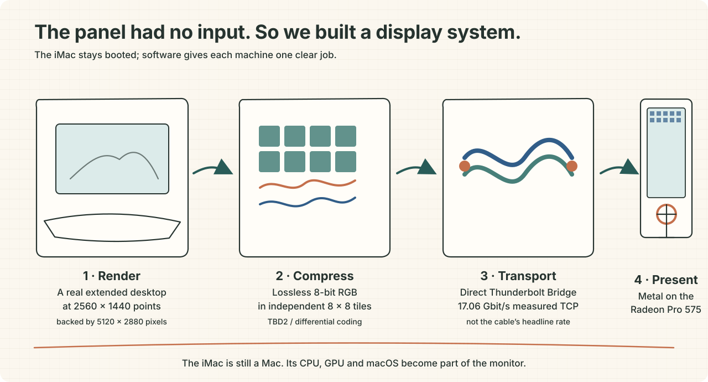
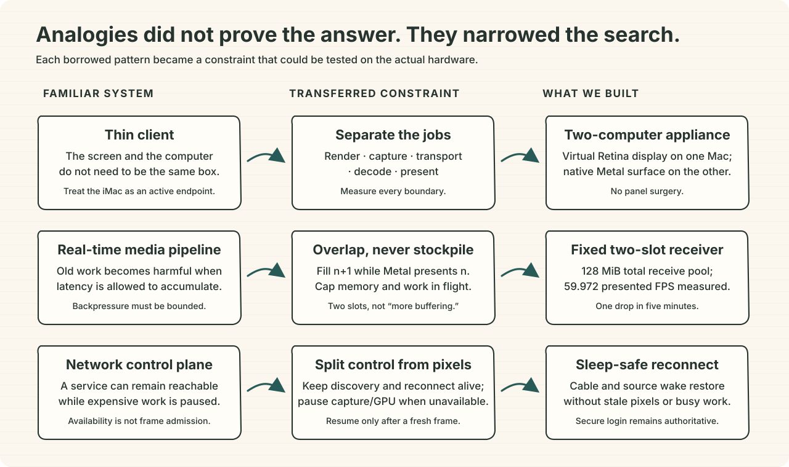
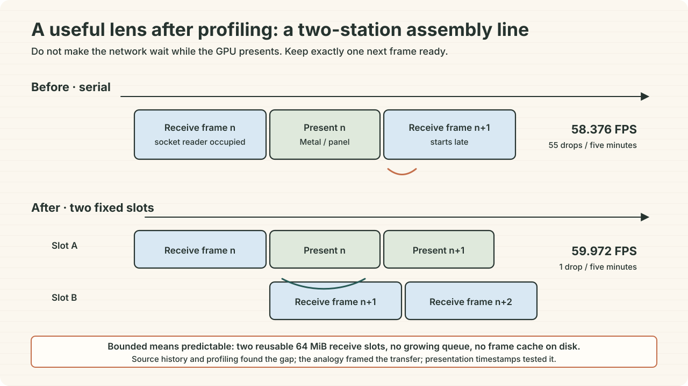
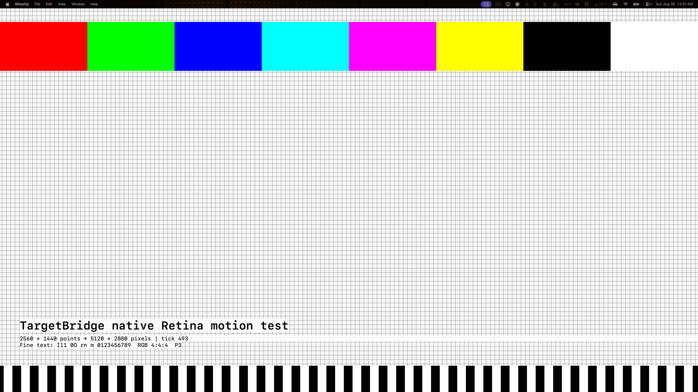

# The panel was fine. The missing input was the problem.

## How we turned a 2017 5K iMac into a software monitor—and what analogical thinking actually contributed

*An explanatory illustration, not a test screenshot. The MacBook renders the
desktop; the cable carries pixels; the still-running iMac presents them.*

A 2017 27-inch iMac contains a beautiful 5120 × 2880 Retina panel, but Apple
did not give that model a video-input mode. [Target Display
Mode](https://support.apple.com/105126) ends with much older iMacs. Plugging in
a Thunderbolt cable therefore connects two computers; it does not turn the iMac
into a passive monitor.

Our constraint made the problem more interesting: do not open the iMac, replace
its controller board, soften the image, or invent missing pixels. We wanted a
normal macOS extended desktop with native Retina geometry, lossless captured
color, useful 60 Hz-class motion, automatic reconnection, one cursor, and no
growing cache or queue.

On our exact 2017 iMac, we reached **59.972 presented frames per second** in a
corrected five-minute run, with **one dropped presentation**, **zero protocol or
GPU errors**, and a full-resolution, lossless 8-bit RGB path. The display appears
in macOS's normal arrangement panel, survives cable reconnection, and pauses
when the source display is unavailable. It has also become the owner's preferred
software-display experience over Luna Display.

That result is real, but it needs boundaries. This is a personal appliance
validated on one `iMac18,3` with a Radeon Pro 575. It is not a passive input,
zero-latency hardware, HDR/10-bit proof, a universal release, or a claim that we
invented software displays or lossless 5K streaming.

## The actual problem was four problems

A monitor hides a pipeline. Once the panel has no input, every stage becomes
software:

1. **Geometry:** persuade macOS to render a real 2560 × 1440 HiDPI desktop backed
   by 5120 × 2880 pixels.
2. **Fidelity:** preserve the captured desktop pixels instead of sending a
   chroma-subsampled movie.
3. **Cadence:** capture, move, decode, and present each frame quickly enough that
   the result feels like a display rather than remote access.
4. **Appliance behavior:** wake, pause, reconnect, keep one cursor, remember the
   display arrangement, and avoid unbounded memory or storage growth.

*The implemented path. The operating systems remain active at both ends; the
iMac's GPU presents the received frame fullscreen.*

The cable's **40 Gbit/s** label is not application throughput. Our direct TCP
test over Thunderbolt Bridge measured **17.06 Gbit/s** from the MacBook to the
iMac. Raw 8-bit RGB at 5120 × 2880 and 60 frames per second is roughly **21.2
Gbit/s before transport overhead**. A different cable cannot turn the iMac's
Thunderbolt 3 endpoint into Thunderbolt 5.

That ruled out “just send unpacked RGB” and reframed the question: how do we keep
every captured RGB pixel while making the representation and pipeline efficient
enough for the link and the older Radeon GPU?

## What had already been done

This project starts with
[TargetBridge](https://github.com/swellweb/targetBridge), and that credit matters.
TargetBridge already provided the product-shaped foundation:

- Sender and Receiver applications;
- mirrored and extended virtual displays;
- Bonjour discovery and Thunderbolt Bridge transport;
- H.264/HEVC profiles up to experimental 5K60;
- input, audio, brightness, clipboard, and reconnect features;
- a native Metal receiver and diagnostic raw paths.

Two upstream contributions were especially important. Aykut Alpgiray Ates's
[lossless 5K60 experiment](https://github.com/swellweb/targetBridge/pull/158)
developed the tiled TBD2/DPCM direction, GPU encode/decode work, slicing, and
bounded receiver assembly. Betafer's
[native Metal receiver](https://github.com/swellweb/targetBridge/pull/174)
demonstrated a direct presentation path and included testing on a 2017 Retina
iMac.

So did TargetBridge already solve the problem? **It solved most of the
architecture and proved several of the hard mechanisms.** A user could already
get a useful video-coded software display. The remaining work for our goal was
to combine and narrow the right experimental ideas, fit them to the maintained
path, validate them on the exact 2017 Radeon machine, remove a cadence
bottleneck, and turn the result into a stable personal appliance.

| Prior work we built on | What this derivative added |
|---|---|
| Virtual display, discovery, streaming, input, and reconnect foundations | A dedicated `iMac18,3` appliance profile and reproducible exact-hardware setup |
| TBD1/TBD2 and GPU-codec work in PR #158 | Conservative lossless integration plus malformed-input, lifecycle, and accounting hardening |
| Native Metal receiver work in PR #174 | Radeon Pro 575 presentation validation, corrected physical presentation timing, and sleep/reconnect behavior |
| Existing 5K profiles, including experimental 5K60 | A corrected serial-versus-overlapped A/B that isolated and removed the maintained path's cadence bottleneck |
| General-purpose app distribution assumptions | Stable local signing and launch paths so one private installation can retain macOS screen-recording permission |
| Upstream identity and documentation | A separately named personal derivative, independent visuals, attribution, provenance, and a no-support posture |

This is an **integration, reduction, hardening, and exact-hardware validation
contribution**. It is not a clean-room invention and not a claim that nobody had
considered bounded pipelines before.

### Where the frontier actually moved

The frontier moved in three specific, testable ways—not in the invention of a
new display category or codec:

- **Hardware boundary:** the lossless DPCM and native Metal ideas were made to
  work together on the older 2017 `iMac18,3` and Radeon Pro 575, rather than only
  existing as separate upstream experiments or newer-hardware evidence.
- **Cadence boundary:** the maintained full-frame receiver moved from a measured
  58.376 presented FPS with 55 drops to 59.972 FPS with one drop by removing
  serialization without creating an accumulating queue.
- **Product boundary:** the experiment gained the less glamorous behavior that
  makes it usable every day on this setup—stable local permission identity,
  one-cursor ownership, sleep/lock pausing, cable-replug recovery, bounded
  memory, and recorded rollback and test evidence.

That is a meaningful push for this exact configuration. It is deliberately not
worded as a universal first.

## What analogies changed

Analogical reasoning was useful because it changed the shape of the search. We
stopped asking, “How do we force a 2017 iMac to accept a display signal?” and
asked, “What other systems preserve an output device while relocating the work
that feeds it?”

### Analogy 1: a thin client, not a monitor cable

A thin client keeps a small computer at the viewing end and moves the
application's visual result across a network. That maps cleanly to the hardware
we actually own: macOS and the Radeon GPU continue running on the iMac while the
MacBook owns the desktop.

This analogy prevented a dead end. No userspace driver can make the 2017 iMac's
Thunderbolt controller expose a physical DisplayPort input that the hardware
does not provide. But software can make the two Macs cooperate as one display
appliance.

### Analogy 2: a bounded real-time assembly line

Video systems, audio engines, network routers, and game renderers share a rule:
overlap independent work, but never let stale work accumulate. A queue that
grows may improve throughput on paper while making interaction progressively
later.

Our conservative path still serialized two jobs: receive/assemble a complete
frame, then present it. The network waited while the GPU displayed; the GPU
waited while the next frame arrived. The safe transfer was a fixed two-slot
handoff. While Metal presents frame A, the network fills frame B; then they swap.

*This did not add an accumulating frame queue. Two fixed 64 MiB slots bound the
receiver frame pool at 128 MiB and stale epochs are discarded.*

Upstream PR #158 had already encountered the general bounded-assembly issue in
its sliced transport. The new step was recognizing the same pattern inside the
maintained full-frame path and transferring only the minimum mechanism needed
for the 2017 machine. The result was not “more buffering”; it was **one frame of
bounded overlap**.

### Analogy 3: separate the control plane from the data plane

Networks often keep a lightweight control plane alive while the data plane is
quiet. We applied the same idea to display lifecycle. Discovery, heartbeat, and
session state can remain available while pixel production pauses because the
MacBook is locked, asleep, or disconnected. When the source becomes valid
again, the session starts a fresh frame epoch instead of presenting stale data.

That is what makes the system behave more like an external monitor: the iMac's
own screensaver is disabled for the appliance account; source inactivity pauses
the display surface; cable return triggers reconnection instead of requiring a
new manual session.

### Analogy 4: a framebuffer codec, not a movie codec

A desktop is not a camera. Text edges, one-pixel lines, and UI colors matter
more than cinematic compression efficiency. The active mode therefore uses
lossless 8-bit BGRA represented with tiled DPCM/TBD2. It does **not** use HEVC,
NV12 chroma subsampling, AI upscaling, or downsampling for the tested result.

Changed-tile protocols are a related remote-framebuffer analogy and remain a
promising optimization for mostly static desktops. We researched that direction
but did not put it into the qualified path: full-frame damage discovery and
recovery correctness can cost more than they save, and the measured two-slot
path already met the owner's experience goal. It is documented as
[future research](../research/changed-region-protocol.md), not described as a
finished feature.

## Were the analogies load-bearing?

**Practically, yes; logically, no.** A sufficiently patient engineer could have
found the serialized receiver stage through profiling alone. The upstream code
and pull requests already contained most of the mechanisms. It would therefore
be dishonest to say analogy made an otherwise impossible invention.

But without analogy, the likely next moves were a faster cable, more video
compression, a larger queue, speculative changed-tile work, or an AI model. None
directly addressed the measured serialization. The assembly-line analogy made
the two-slot handoff obvious; the control-plane analogy supplied the lifecycle
shape; the thin-client analogy clarified what the product physically is.

The fairest summary is:

> **Prior art supplied the core mechanisms. Analogy shortened the search and
> supplied the safety constraints. Profiling and physical presentation
> timestamps supplied the proof.**

## Transferring the analogy was the hard part

“Double-buffer it” fits in a sentence. Making that sentence safe in a real
display stack did not.

- **Bound the memory.** Exactly two preallocated frame slots are allowed; there
  is no growing display queue and no disk-backed frame cache.
- **Keep lifetimes valid.** Network writes, GPU command buffers, Metal textures,
  and application shutdown must not outlive the memory they reference.
- **Fail closed.** Malformed tiles, impossible lengths, mixed frame epochs,
  queue-accounting errors, and renderer-order faults stop or discard work rather
  than displaying corrupted memory.
- **Measure presentation, not intention.** The first timing oracle counted a
  zero/dropped Metal outcome as success. The corrected result uses the
  drawable's physical `presentedTime` and treats invalid outcomes as failures.
- **Reset cleanly.** Sleep, lid close, cable loss, and receiver restart begin a
  fresh session epoch so an old frame cannot leak into a new desktop session.
- **Stabilize macOS identity.** Rebuilding ad hoc-signed apps changes what macOS
  Privacy considers to be the requesting program. A dedicated local certificate,
  fixed bundle identity, and fixed install path stopped the recurring
  screen-recording prompts for this private installation.

The permission regression during development came from replacing builds with
unstable signing identities—not from the display protocol. The final local
installer preserves the approved identity. It is deliberately not a public
notarized distribution system.

## What the measurements say

The key experiment compared the original serial presentation loop with the
fixed two-slot overlap on the same MacBook-to-iMac system. These are corrected
five-minute runs using physical Metal presentation timestamps.

| Measurement | Serial path | Two-slot overlap |
|---|---:|---:|
| Source cadence | 59.993 FPS | 59.983 FPS |
| Physically presented cadence | 58.376 FPS | **59.972 FPS** |
| Presented frames | 19,417 | 17,943 |
| Dropped presentations | 55 | **1** |
| p95 / p99 interval | 16.8 / 33.4 ms | **16.8 / 16.8 ms** |
| Maximum interval | 616.741 ms | **33.376 ms** |
| Payload | 6.200 Gbit/s | 6.434 Gbit/s |
| Integrity, queue, GPU, renderer, or order errors | 0 | **0** |

The different presented-frame totals reflect different capture durations around
setup and teardown; cadence and intervals are the comparable outcomes. The full
raw evidence and method are in the
[corrected A/B record](../repro/imac-2017-5K/results/2026-08-30-v0.9-corrected-overlap-ab.md).

The corrected overlap record also includes a five-minute resource sample. It
excluded the first 60 seconds and reported:

- Sender CPU: 30.46% mean, 38.60% maximum;
- Receiver CPU: 48.81% mean, 57.10% maximum;
- Receiver RSS: 152,552 to 153,360 KiB, an 808 KiB change;
- no application-support, log, or frame-cache storage growth;
- no thermal-pressure report on either machine during the sample.

Those numbers show a bounded short run, not a universal “no leak” proof. The
exact v0.9 overlap build still needs a longer one-hour soak before broader release
claims. The detailed sample is in the same
[corrected A/B record](../repro/imac-2017-5K/results/2026-08-30-v0.9-corrected-overlap-ab.md).

## What the finished experience looks like

*Owner-captured System Settings evidence. `TB Extend – 2017 iMac Raw Metal`
coexists with a Dell display and the MacBook's built-in display and can be
arranged normally.*

*The 5120 × 2880 source test raster. This records the source geometry and test
content; macOS screenshot APIs cannot prove the shielded Metal output on the
physical iMac panel.*

On the qualified setup:

- macOS sees a 2560 × 1440 HiDPI extended desktop backed by 5120 × 2880 pixels;
- the captured 8-bit RGB pixels are transported losslessly in the active mode;
- text, color blocks, motion, clicking, and dragging were accepted on the
  physical iMac by the owner;
- the duplicate receiver cursor was removed;
- cable replug and source sleep/wake restore the display session automatically;
- the iMac uses its appliance waiting/paused surface instead of its own
  screensaver;
- the path coexists with the MacBook's built-in screen and a separate Dell
  display.

The display can be moved in **System Settings → Displays → Arrange** like another
macOS display because the MacBook owns a real virtual extended desktop. The iMac
itself must remain powered on, booted, and logged into the dedicated receiver
account.

## What we did not build

This project does not turn the 2017 iMac into an electrical video-input device.
It does not work before the iMac login screen or bypass FileVault. The qualified
path is 8-bit SDR Display P3, not 10-bit/HDR. It does not promise zero latency,
even when the interaction feels immediate. It currently trusts a direct local
Thunderbolt link rather than encrypting the pixel protocol, and Wi-Fi fallback
is intentionally not part of the personal appliance profile.

No AI model is in the display loop. An AI classifier would consume compute and
introduce failure modes without fixing the bottleneck we measured. It would only
belong in a later phase if a specific prediction—such as cheap region-change
selection—beat a deterministic baseline under controlled quality, latency,
power, and recovery tests.

## Reproducing it

This repository is prepared as a personal, attributed derivative rather than a
supported product. To reproduce the tested configuration:

1. Use a 2017 27-inch iMac (`iMac18,3`) and a MacBook connected directly by a
   certified Thunderbolt cable.
2. Enable Thunderbolt Bridge on both Macs and confirm the direct interface.
3. Build and install the Receiver on the iMac and the Sender on the MacBook using
   the stable local-signing workflow.
4. Grant Screen & System Audio Recording to the installed Sender identity once.
5. Install the per-user launch agents and the receiver appliance preferences.
6. Select the dedicated extended 5K lossless profile and arrange it in macOS
   Displays settings.
7. Run the component, lifecycle, reconnect, presentation-cadence, and resource
   checks before treating a different machine as qualified.
8. Keep the iMac booted and logged into its appliance account; plug or unplug the
   direct cable as you would connect or disconnect the monitor.

The exact commands, expected identities, rollback steps, and test records live in
the [2017 iMac reproduction guide](../repro/imac-2017-5K/README.md). Binary hashes
and signature checks are covered by [binary verification](../verify-binaries.md).
The [asset provenance record](../ASSET-PROVENANCE.md) explains every screenshot
and diagram used here.

## Acknowledgements and scope

This derivative exists because the TargetBridge maintainers and contributors
published a capable foundation. In particular, the lossless/GPU work in
[PR #158](https://github.com/swellweb/targetBridge/pull/158) and the native Metal
receiver work in
[PR #174](https://github.com/swellweb/targetBridge/pull/174) materially informed
the implementation. The repository preserves upstream authorship and license
history; it uses a separate project identity and original documentation visuals.

The owner built this for personal use and does not promise development, support,
compatibility, or binaries for anyone else's hardware. The source and evidence
are documented so another engineer can inspect the claims, reproduce the work,
or carry the idea further under the repository's [license](../../LICENSE).
